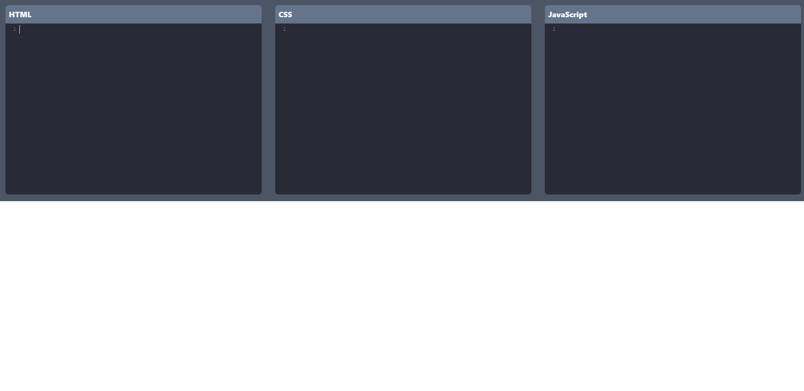
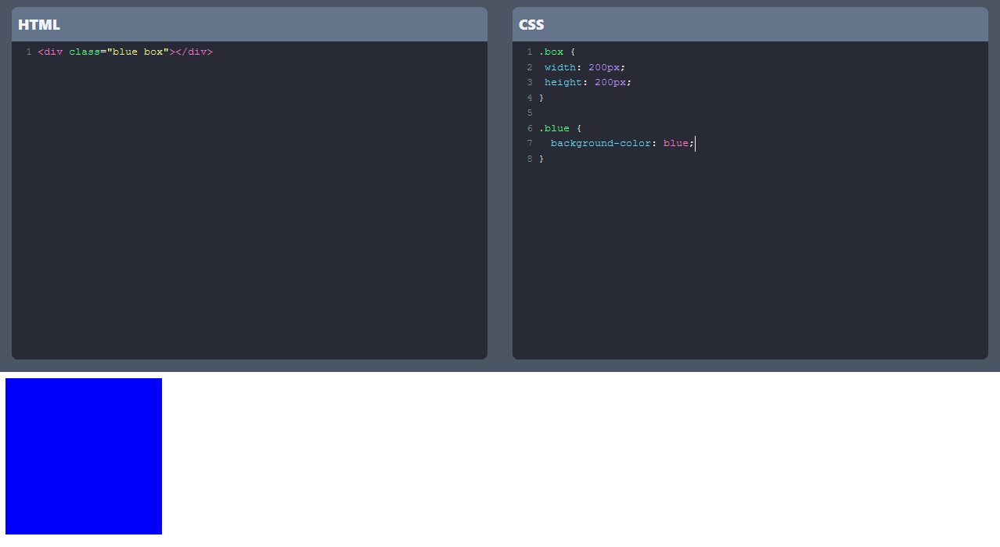
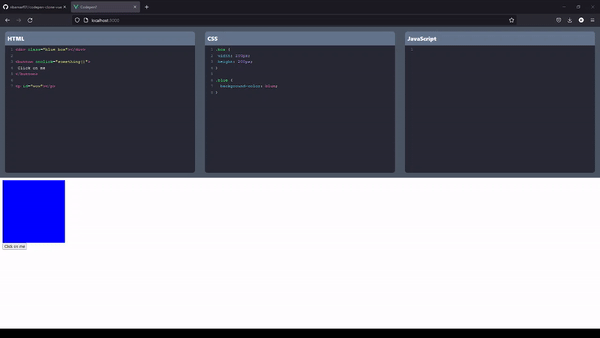

# Codepen clone on VueJS!

## 👀 Project Overview

- 😎 A app that simulate Codepen main functionality to write HTML, CSS and JavaScript made in Vue
- 👨‍💻 Uses Vuex to keep the code state the same between components and CodeMirror to easily build a code editor component with syntax highlight... and Dracula theme 🦇.
- 🔗 You can find this project live on: https://codepen-clone-vue.vercel.app.

## 🔥 Techs used

<div style="
    display: inline-block
">
    
    
    
</div>

## 🔧 Build Setup

```bash
# install dependencies
$ npm install

# serve with hot reload at localhost:3000
$ npm run dev

# build for production
$ npm run build

# project preview
$ npm run preview

You can also use yarn!
```

## 📷 Project images





## 👽 External links

- 🔗 Codepen: https://codepen.io/
- 🔗 CodeMirror: https://codemirror.net/
- 🔗 How to set CodeMirror on Vue (Helped a lot!): https://www.youtube.com/watch?v=oDitntruMLc